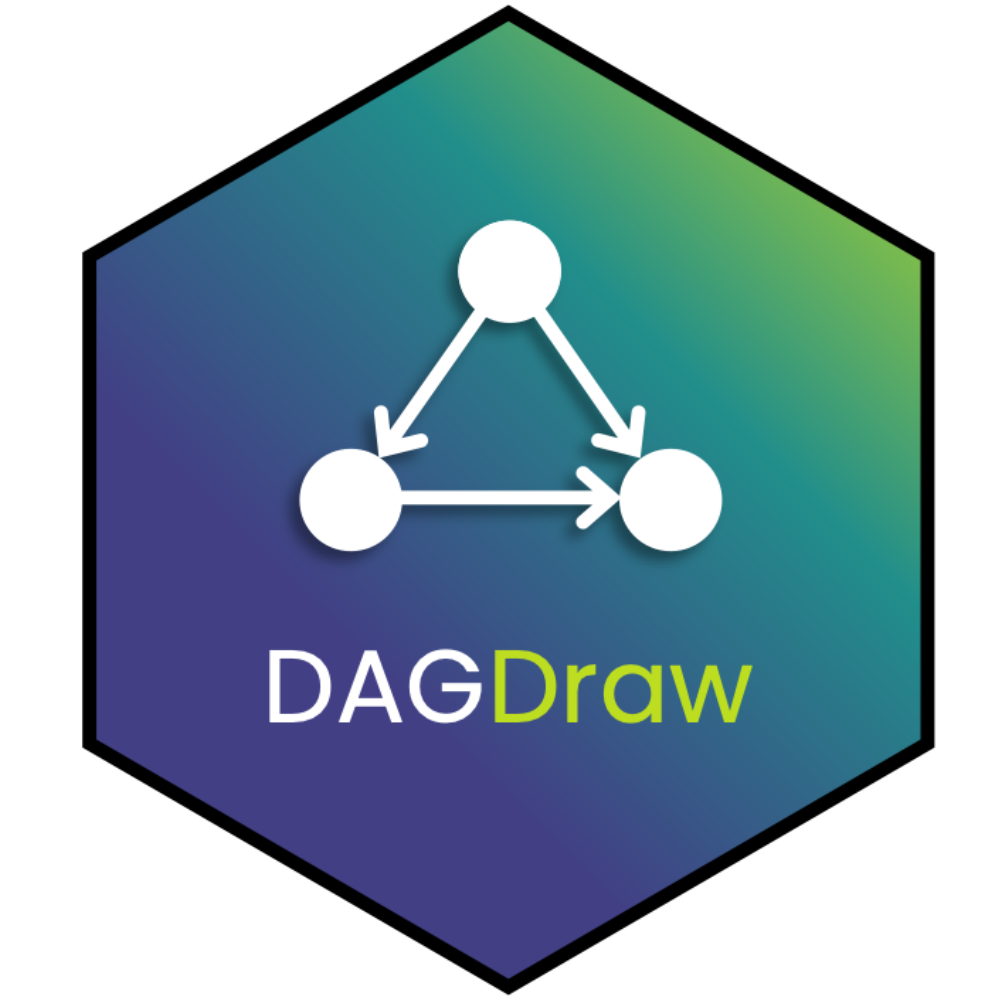

# DAGDraw - Causal Diagrams Visualization 

A Shiny application for building and analyzing Directed Acyclic Graphs (DAGs) to support causal reasoning in research.

## Overview

DAGDraw enables researchers to:
- Visualize causal relationships between variables
- Identify and analyze backdoor paths
- Perform transportability analysis
- Determine necessary control variables

## Installation

### Package Management
This project uses renv for dependency management. To install required packages:

##```R
renv::restore()

## Note for Mac users: If igraph installation fails, try:
renv::install("igraph", type = "binary")

For igraph source installation troubleshooting, visit: https://r.igraph.org/articles/installation-troubleshooting


# DAGDraw - Causal Diagrams Visualization shiny app 

This shiny app has been built to faciliate causal reasoning. With this tool, users can build causal diagrams, Directed Acyclic Graphs (DAGs), to visually represent assumptions about causal relationships between variables.

This app has been developed by members of [Core Clinical Sciences](https://www.coreclinicalsciences.com)

Main contact: [Quang\@coreclinicalsciences.com](mailto:Quang@coreclinicalsciences.com)

## User Guide

Once the app is running, - You can name the `Treatment` and `Response` nodes that will pop up in the tool

-   Choose if the causal question of interest is related to transportability analysis or not.

-   Transportability analysis option will provide `Treatment`, `Response`, and `Participation` nodes.

-   Other (non-transportability analysis) option will provide `Treatment` and `Response` nodes without the `Participation` node.

-   You can add nodes with the `Add Nodes` button.

-   While viewing the current nodes, edit their connections (parents and children) and whether they are measured or unmeasured.

-   Once your relationships are in place you can check for open back door paths and condition on nodes to eliminate these paths.

-   When transportability analysis is enabled, you can also check for effect modifiers to control for in your analysis.
